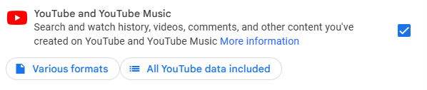
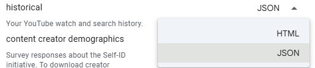

# YouTube Watch History Viewer

YouTube Watch History Viewer is a tool to help users to track their recently watched videos on YouTube and have a backup of their accounts in a versatile and organized way. It uses downloadable data from **Google Takeout**, where users can export their data. Since there isn't a pratical way to view those files, this web application offers a solution.

## 📖 How to use it?

- Go to [Google Takeout](https://takeout.google.com/)
- Uncheck everything except the YouTube option
  
  
  
- Under **Watch History** option choose the .json format

  
  
- Customize YouTube export settings
- Download the compressed folder containing the data
- Unzip it and locate the **watch history .json file** 
- Open this application and upload the file
- If everything works correctly, you'll see your watch history and your most recent watched videos

## 🔍 Why use it?

YouTube's watch history can sometimes be deleted due to automatic deletions, bugs, or other issues. By keeping an active backup you can prevent eventual losses.

## 📱 Other details
- This application works better on Google Chrome
- More features will be added in the future
- This project is on its beginning, so it may contain errors 
